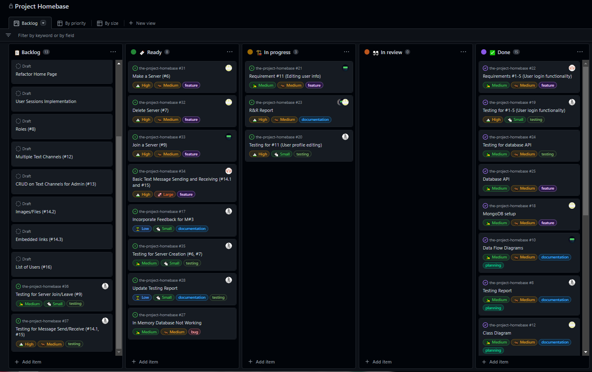
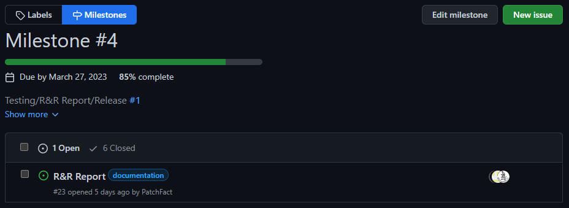

# R&R Report: Milestone #4

## Progress

### Github Projects Snapshot

### Milestone Snapshot

### Tasks Completed

**Brock**

-   Database Design and Schema for MongoDB/Mongoose
-   Provided troubleshooting and expertise in JavaScript web development
-   Provided boilerplate for webapp

**Rommel**

-   Login/Logout Functionality
-   Account Creation/Deletion
-   Password Recovery

**Jaidyn**

-   User Editing Functionality
    -   Changing Profile Picture
    -   Changing Name
    -   Short bio

**Esteban**

-   Testing for Login/Logout/Account Creation/Password Recovery
-   Testing for User Editing
-   Issue tracking and documentation (R&R Report)

### Big Picture

Overall, the progress for this milestone was quite satifactory for the team, and we felt like the estimation of tasks was adequate. A couple of tasks needed to be extended due to the overhead of learning to use `Node`, `Express`, and `JavaScript`, for some of the team members. We felt like the progress made regardless was good for this stage of the project, and are in high spirits about achieving the following deadlines now that everyone is more familiar with the tools.

## Testing

Currently, the main branch is passing all login/logout and user creation tests. We have set up CI/CD in the form of Github actions which check new pushes for passing the test suite. We achieved this with the `Jest` testing package in combination with the `SuperTest` package.

## Reflection

### Members

**Brock**

The project is currently going at a steady pace. We've finished the overall user account and creation functionality (though sessions still need to be implemented). I worked on the database design and schema creation for Mongoose/MongoDB, and am currently unsure if I sure create an adapter pattern right now to further wrap the Mongoose schema to develop in a more OOP approach. Overall we are on a good path to have all our requirements satisfied for the deadline in a few weeks.

**Rommel**

This milestone involved implementing the backend and some frontend functionality for the user authentication and account management features of our Homebase application. These features were implemented using Express JS, and Node which would contact with our MongoDB. The implementation was successful and meets the project requirements. Moving forward I will have to look into how the reset password link can be sent to a verified email, instead of printing the link to the console. Further improvements and additional features could be added in future milestones.

**Jaidyn**

This milestone I watched around 4 hours of youtube videos for different languages we are using as I was unfamiliar with almost all of them. I was tasked with creating the editing of a users profile. I started on Friday by creating the landing page and going through many iterations before I landed on one that I liked enough. Next was adding the functionality and that was/is a hassle for me because I didn't know the best way to approach it and it was all very confusing for me.
I feel as a group we made great progress, although I feel that I didn't do as much as the other group members. I think everything is working good so far and we haven't ran into many issues regarding teamwork.

**Esteban**

For this milestone, the biggest hurdle for me was becoming familiar again with `Node` and learning how to create tests using the `Jest` package. I had used `Node` before, but was out of practice and had to invest some time into getting a grip for it again. Creating test proved challenging, as it required a more thorough understanding of how our app is structured and how its components are meant to interact (read, MongoDB). Due to this, I did not manage to write the entire suite of tests I was hoping, which was slightly dissapointing. However, finally getting all my test to work properly and feeling like I understand the process has been very rewarding, and leads me to think the following milestone won't be as hard.

### Team

Overall, the team is feeling optimistic about the outlook for the following milestone and happy with what was achieved so far. We do not yet have a release candidate as our core functionality is not finished, but we are aiming to have a basic prototype ready by next Thursday. During this sprint, the majority of the tasks assigned were completed, and the remaining were partially covered. These remaining tasks were discussed with the whole team and rescheduled, with the future tasks being adjusted accordingly.

We feel like we are working with a velocity in line with our expectations, and have managed to push through the challenges presented so far.

## Future Tasks

After our retrospective, we decided to re-prioritize some of our tasks in order to more clearly determine what we need to do moving forward.

### Need to Haves (in order of priority)

-   User must be able to make a server (#6)
-   User must be able to delete servers they are owners of (#7)
-   User must be able to join a server (#9)
-   User must be able to leave a server (#10)
-   User must be able to send message for a given channel in a server, and has the potential to include (#14):
    -   Basic Text (#14.1)
-   User must receive incoming messages as they are posted (#15)
-   Refactor home page
-   User sessions

### Nice To Haves (in order of priority)

-   User must be able to assign roles to themselves and other users on servers they are administrators on (#8)
-   User must be swap between text channels for servers they are in (#12)
-   User must be able to perform CRUD operations for text channels for servers they are admins (#13)
-   User must be able to send message for a given channel in a server, and has the potential to include:
    -   Images/Files (#14.2)
    -   Hyperlinks (#14.3)
-   User must be able to view members of server (#16)

## Future Sprint Split and Goals

### Split

Based on the above we decided to split it as such:

**Brock**

-   #6
-   #7

**Rommel**

-   #14

**Jaidyn**

-   #9
-   #10

**Esteban**

-   Testing for all requirements in progress

### Goals

Working prototype by Monday at best, Thursday at worst, so we can focus on bugs / nice to have's
